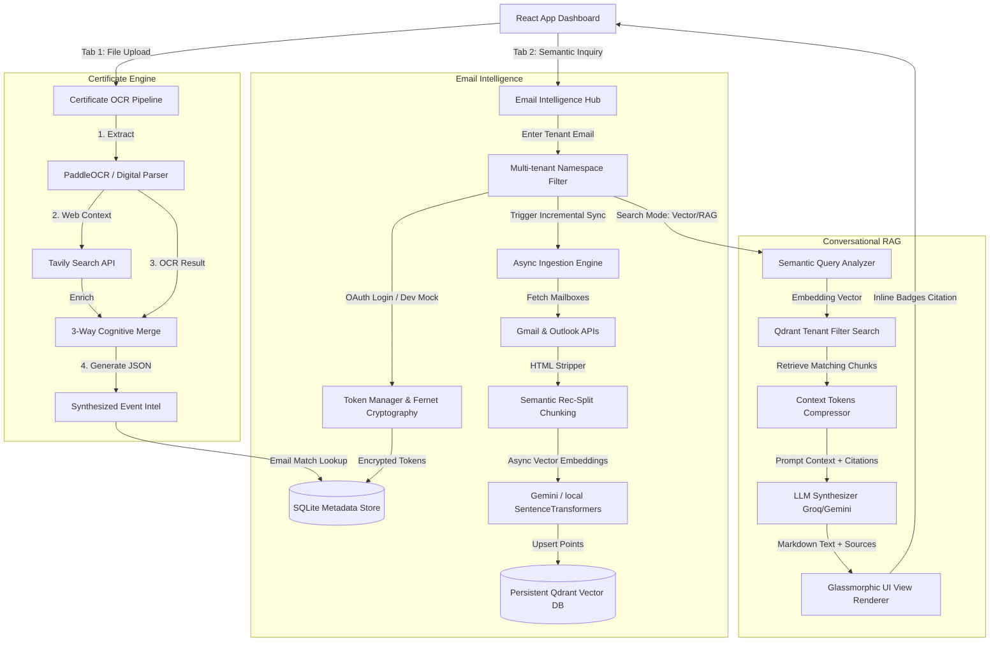

# Agentic Certificate Intelligence & Semantic Search Hub

A production-grade, highly polished, and secure document processing and semantic retrieval platform. It integrates a digital and multi-lingual visual OCR analysis pipeline with an asynchronous email intelligence network, enabling developers to connect mailboxes via OAuth 2.0, build a local or cloud vector store, and perform conversational Retrieval-Augmented Generation (RAG) queries with high-fidelity citations.

---

## 🌟 Key Architecture & Features

### 1. Unified Glassmorphic UI Dashboard
- **Certificate OCR Engine Tab**: An interactive dropzone supporting PDF, PNG, JPG, WEBP, and TXT. Extracts visual text layer information (integrating PaddleOCR) and correlates events across a 3-way cognitive merge (OCR data, mailbox linkages, and web context lookups).
- **AI Email Intelligence Hub Tab**: A secure management deck that controls tenant email linkages, maps synchronization timeline status logs, lists database indexing metrics, and allows natural language inquiries.

### 2. Multi-Tenant Email Indexing & OAuth 2.0 Authentication
- Built-in credentials handlers for **Google Gmail** and **Microsoft Outlook (MS Graph)**.
- Secure, production-ready symmetric token storage: Refresh and access tokens are encrypted on disk using standard AES-256 Fernet keys (`SymmetricFernet`).
- **Developer Sandbox Mode**: If OAuth credentials are not configured in `.env`, the system activates an offline mock pipeline automatically. Triggering "Connect" registers a sandbox inbox instantly with realistic mock credential emails, enabling deep testing completely offline!

### 3. Asynchronous Semantic Ingestion & RAG Orchestration
- **Smart Chunking**: Paragraph-aware recursive text splitting with heuristic signature/junk markers isolation.
- **Async Embeddings**: Dynamic multi-provider support:
  - **Gemini Embeddings** (`models/text-embedding-004`)
  - **OpenAI Embeddings** (`text-embedding-3-small`)
  - **Local Fallback** (`all-MiniLM-L6-v2` via SentenceTransformers), ensuring offline developer compliance and zero startup blocks.
- **Embedded Persistence**: Auto-managed Qdrant vector store runs fully embedded out of the box in the `cache/qdrant/` directory (no complex docker-compose setup required for development).
- **Conversational RAG Summarizer**: Compiles retrieved semantic hits, compresses active context tokens, and queries LLMs to synthesize answers with markdown styling and bracketed citation highlights (e.g. `[1]`, `[2]`), rendered as glowing glowing badge elements in the UI.
- **GDPR Compliance**: An absolute wipe routine deletes SQLite tables, revokes credentials cache, and clears Qdrant vector spaces mapped to the tenant key.

---

## 🏗️ System Architecture Flow



---

## ⚙️ Environment Variables (`backend/.env`)

Configure the following values inside the `backend/.env` file:

```env
# Server
HOST=0.0.0.0
PORT=8001
DEBUG=True

# LLM APIs
GROQ_API_KEY=your_groq_api_key
GROQ_MODEL=llama-3.3-70b-versatile
GROQ_VISION_MODEL=meta-llama/llama-4-scout-17b-16e-instruct

# Web Search API
TAVILY_API_KEY=your_tavily_api_key

# Directory Settings
UPLOAD_DIR=./uploads
CACHE_DIR=./cache
DB_PATH=./cache/metadata_cache.db

# Multi-tenant SQLite Metadata Storage
DATABASE_URL=sqlite:///./cache/email_intelligence.db

# Fernet Secret Cryptography (Optional: Auto-generated if absent)
SECRET_KEY=your_32_byte_base64_encryption_key

# Vector Database (Optional: Persists locally to cache/qdrant if left empty)
QDRANT_URL=
QDRANT_API_KEY=
```

---

## ⚡ Running the Platform Locally

### 1. Start the FastAPI Backend
Ensure Python 3.12+ is installed, then launch the API:

```powershell
# Navigate to backend directory
cd backend

# Install dependencies
pip install -r requirements.txt

# Start uvicorn server
uvicorn app.main:app --host 0.0.0.0 --port 8001 --reload
```

- **Interactive Swagger Docs**: Available at `http://localhost:8001/docs`

### 2. Start the React Frontend
Ensure Node.js is installed, then launch the development server:

```powershell
# Navigate to frontend directory
cd frontend

# Install packages
npm install

# Start Vite server
npm run dev
```

- **Dashboard Interface**: Open your browser at `http://localhost:5173`

---

## 🔒 Multi-Tenant Privacy & Data Security
1. **Tenant Namespace Isolation**: All vector collection indexes inside Qdrant are securely queried using strict metadata payload filtering. No query or document search will cross namespaces:
   ```python
   tenant_filter = Filter(
       must=[FieldCondition(key="user_id", match=MatchValue(value=user_id))]
   )
   ```
2. ** Fernet AES Encrypted Credentials**: OAuth tokens are encrypted before hitting SQLite using a persistent key stored inside `cache/encryption.key`.
3. **Wipe & Revoke**: Clicking the GDPR Wipe button removes the User table row, wipes tokens, cascades database sync logs, and invokes Qdrant's point-deletion coordinates for that tenant.
